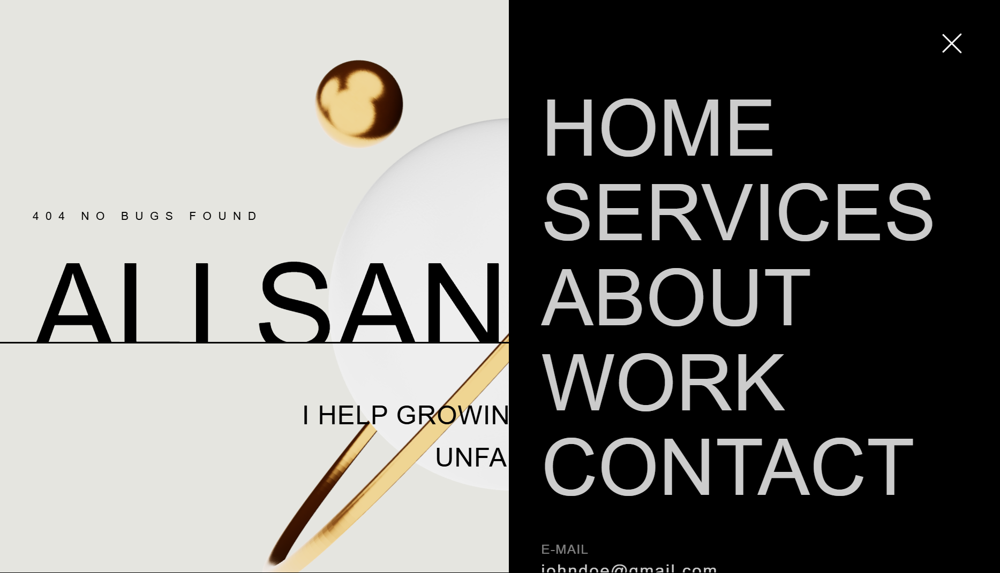
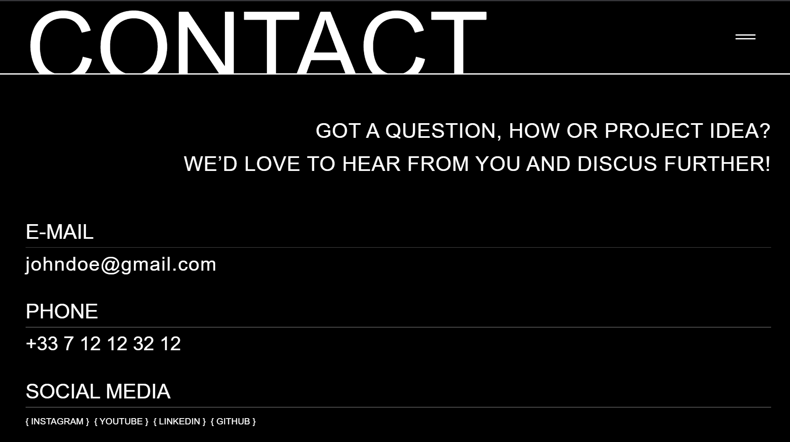

<h1 align="center">🌐 My Developer Portfolio</h1>

  A sleek, modern, and fully responsive developer portfolio built with React, featuring animations, 3D assets, and smooth scrolling.

  

---

## 🚀 Features

- 💻 **Built with React** – Component-based architecture for easy scalability.
- 🎨 **Modern UI/UX** – Clean layout, interactive elements, and dark mode.
- ✨ **GSAP + Lenis Animations** – Smooth, scroll-triggered transitions.
- 🧠 **Dummy Data** – Easily replaceable with real content.
- 📱 **Responsive Design** – Mobile-friendly across all devices.
- 🧩 **3D Models Ready** – Integrates 3D models with WebGL support.

---

## 📸 Screenshots

> Live visual previews of the site

### Some Images of UI Sections

---

## 🛠️ Tech Stack

- **React.js** – Frontend framework
- **Tailwind CSS** – Utility-first styling
- **GSAP** – Animation library
- **Lenis** – Smooth scrolling
- **Three.js (Optional)** – 3D rendering
- **Vite** – Blazing-fast build tool

---

## 📂 Folder Structure

├── public/
│ └── assets/
├── src/
│ ├── components/
│ ├── sections/
│ ├── App.jsx
│ └── main.jsx
├── tailwind.config.js
└── vite.config.js
